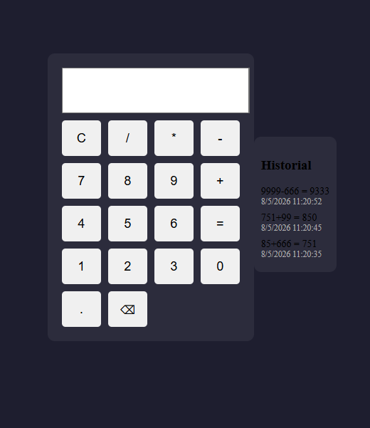

# Calculadora React

Esta es una calculadora completa creada con React y Vite.

## Funcionalidades

- Operaciones básicas: suma, resta, multiplicación y división.
- Puedes escribir una operación y luego presionar `=` para ver el resultado.
- Si presionas un operador después de obtener el resultado, el resultado se usa como primer número y puedes seguir concatenando operaciones.
- Botón `C` para borrar toda la operación escrita.
- Botón `⌫` para borrar solo el último carácter o número.
- Historial guardado en `localStorage` con la operación, el resultado, la fecha y la hora.

## Detalles

- El historial se mantiene aun si cierras la página y vuelve a abrirla.
- Cada cálculo se registra con fecha y hora para que puedas revisar tus operaciones anteriores.
- La interfaz muestra la calculadora y un panel de historial.

## Uso

1. Abre el proyecto en tu editor.
2. Ejecuta `npm install` para instalar dependencias.
3. Ejecuta `npm run dev` para iniciar el servidor de Vite.
4. Abre la aplicación en el navegador y prueba la calculadora.
